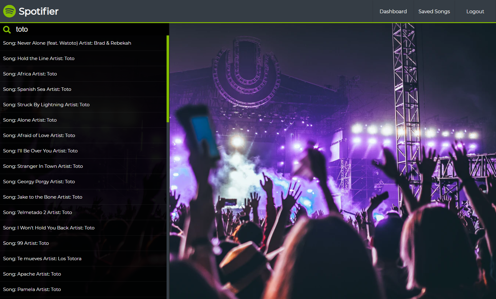
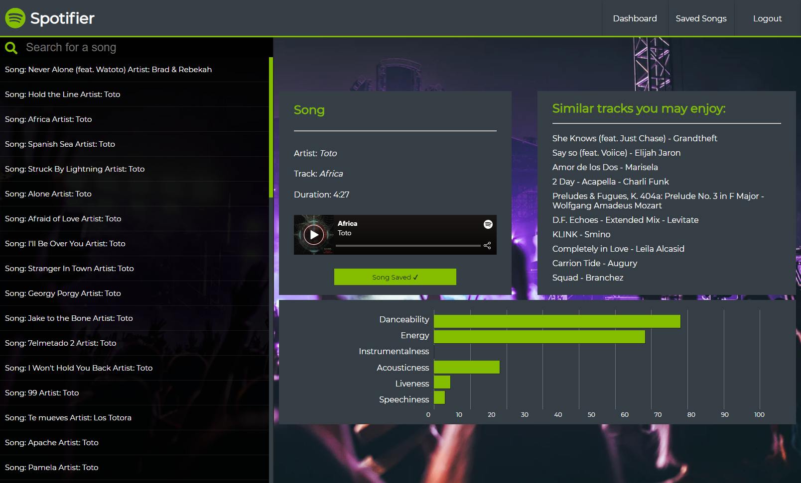

# Spotifier
## About:
- Mission: Connecting people to songs they didn't know they loved
- Application: https://spotify.gettingonthe.net
- Function: App that suggest 10 spotify songs based on song from the data set. User can login and favorite songs they find!

## Tech Stack:
- React
- Sass
- Axios
- Redux / Thunk
### Backend APIS:
- https://github.com/Build-Week-Spotify-Song-Suggester/Back-End - User Auth, CRUD, and Song Recommendations
- https://github.com/TamaHills/spotifier-backend-node - Song Search

## Components:

### Register
#### Create an account to save your track list
https://spotify.gettingonthe.net/register

### Log In 
#### Access your account and find some songs
https://spotify.gettingonthe.net/login

### Dashboard
#### *Accessible after login*

#### Search for songs

#### View stats, listen to the song. View similiar songs.

#### Save song to listen later

### Saved Songs 
#### View saved songs, visit there pages or delete them from your list
