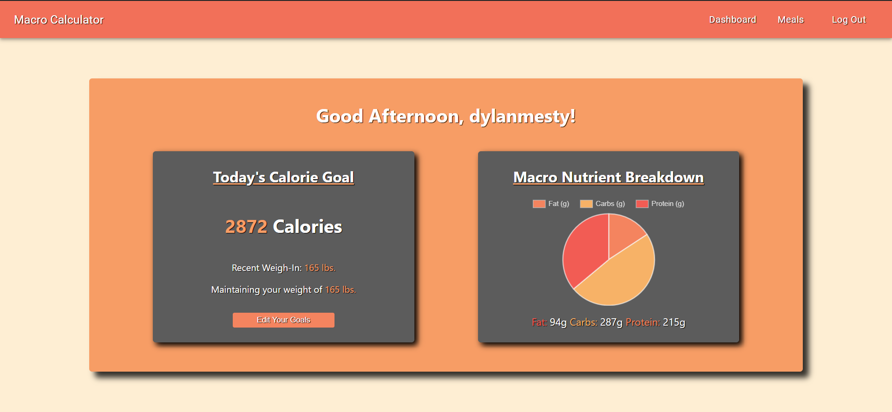
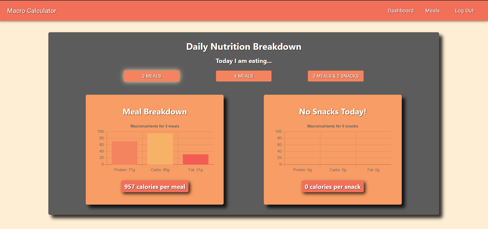
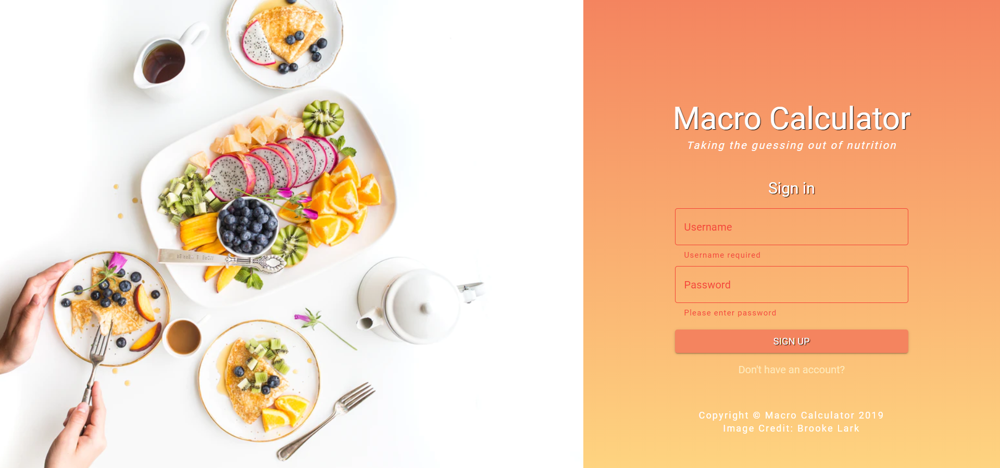
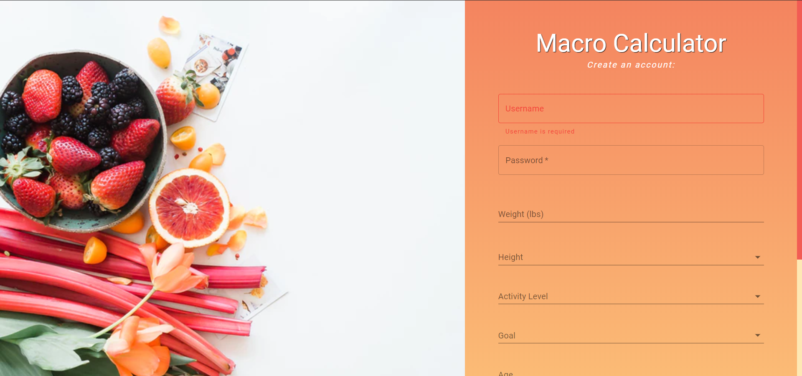

# Macro Calculator
The goal of Macro Calculator is to calculate the user's expected calorie intake specific to their body. 

The deployed version of the project can be seen at: <a href="https://macro-nutrient-calculator.netlify.com/">Macro Calculator.</a>

## Motivation
When it comes to losing or gaining weight, a lot of individuals are unsure where to start in the process. Macro Calculator aims to _"take the guessing out of nutrition"_ by providing the user with estimated nutrition guidelines.

## Features
Macro Calculator provides an estimated goal for the user's daily calorie intake, as well as the macronutrient break down of those calories. The user also has the ability to view different ways to spread out their calories through the day by: _3 meals_, _4 meals_, or _3 meals and 2 snacks_.

Users can:
- Create a new account, which calculates their estimated calorie intake through the onboarding process
- View the dashboard where they can view their calorie goal, macronutrient breakdown of those calories, and edit their current weight or nutrition goal (Switching from _Weight Maintenance_, to _Moderate Weight Gain_)
- Visit the meals page to view how their calories will be divided up if choosing 3 meals, 4 meals, or 3 meals and 2 snacks.

## Getting Started
In order to view the project on your local machine, follow these steps:
- **Fork** the repository
- **Clone** or **Download** the project onto your local machine
- `cd` into `front-end` directory. By then it should look like `/yourSystemDirectories/Front-end/front-end`
- Ensure you install all dependencies
- Run the app with `npm start` or `yarn run`.

## Technologies Used
- React.js
- Redux
- Axios
- Material UI
- Formik
- SASS

 
This was a school project built for <a href="">Lambda School</a>.

Front-end portion of the project built by <a href="https://github.com/dylanmestyanek">Dylan Mestyanek</a>, <a href="https://github.com/Joshua-Edgerton">Joshua Edgerton</a>, and <a href="https://github.com/adelaadeoye">Adeoye Adela</a>.

## Application Screen Shots
Here's a sneak peak into the application!

## Dashboard

## Meals

## Sign In

## Sign Up

